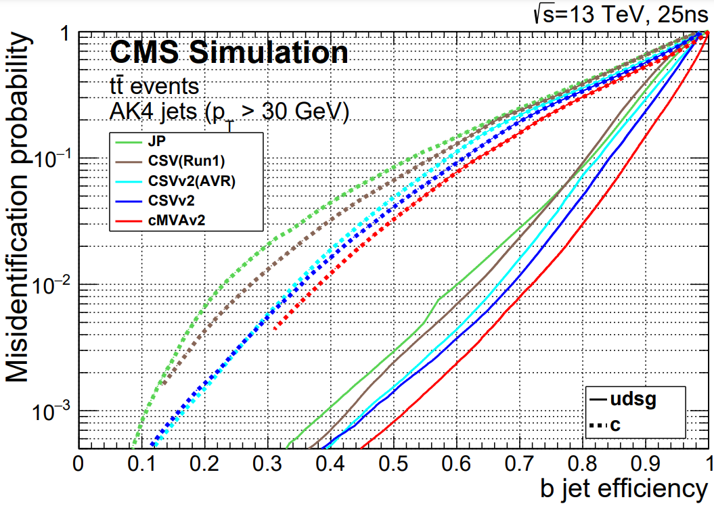

Jet reconstruction and identification is an important part of the analyses at the LHC. A jet may contain
the hadronization products of any quark or gluon, or possibly the decay products of more massive particles such as W or Higgs bosons.
Several "b tagging" algorithms exist to identify jets from the hadronization of b quarks, which have unique
properties that distinguish them from light quark or gluon jets. 

## B Tagging Algorithms

Tagging algorithms first connect the jets with good quality tracks that are either associated with one of the jet's particle flow candidates or within a nearby cone.
Both tracks and "secondary vertices" (track vertices from the decays of b hadrons) can be used in track-based, vertex-based, or "combined" tagging algorithms.
The specific details depend upon the algorithm use. However, they all exploit properties of b hadrons such as:

 * long lifetime,
 * large mass,
 * high track multiplicity,
 * large semileptonic branching fraction,
 * hard fragmentation fuction. 

Tagging algorithms are Algorithms that are used for b-tagging:

 * Track Counting: identifies a b jet if it contains at least N tracks with significantly non-zero impact parameters.
 * Jet Probability: combines information from all selected tracks in the jet and uses probability density functions to assign a probability to each track
 * Soft Muon and Soft Electron: identifies b jets by searching for a lepton from a semi-leptonic b decay.
 * Simple Secondary Vertex: reconstructs the b decay vertex and calculates a discriminator using related kinematic variables.
 * **Combined Secondary Vertex**: exploits all known kinematic variables of the jets, information about track impact parameter significance and the secondary vertices
 to distinguish b jets. This tagger became the default CMS algorithm.

These algorithms produce a single, real number (often the output of an MVA) called a b tagging "discriminator" for each jet. The more positive the discriminator
value, the more likely it is that this jet contained b hadrons. 

## Accessing tagging information

In `JetAnalyzer.cc` we access the information from the Combined Secondary Vertex V2 (CSV) b tagging algorithm and associate discriminator values with the jets.
During the creation of `pat::Jet` objects, this information is merged into the jets so that the discriminators can be accessed with a dedicated member function
(similar merging is done for other useful associations like generated jets and jet flavor in simulation!).

~~~
jet_btag.push_back(itjet->bDiscriminator("combinedSecondaryVertexBJetTags"));

~~~
{: .language-cpp}

We can investigate at the b tag information in a dataset using ROOT. 

~~~
$ root -l myoutput.root // you produced this earlier in hands-on exercise #2
[0] _file0->cd("myjets");
[1] Events->Draw("jet_btag");
~~~
{: .language-bash}

The discriminator values for jets with kinematics in the correct range for this algorithm lie between 0 and 1. Other jets that do not have a valid discriminator value pick up values of -1, -9, or -999.

## Working points

A jet is considered "b tagged" if the discriminator value exceeds some threshold. Different thresholds will have different
efficiencies for identifying true b quark jets and for mis-tagging light quark jets. As we saw for muons and other objects,
a "loose" working point will allow the highest mis-tagging rate, while a "tight" working point will sacrifice some correct-tag
efficiency to reduce mis-tagging. The CSVv2 algorithm has working points defined based on mis-tagging rate ([read more](https://cds.cern.ch/record/2138504/files/BTV-15-001-pas.pdf)): 

 * Loose = ~10% mis-tagging = discriminator > 0.460
 * Medium = ~1% mis-tagging = discriminator > 0.800 
 * Tight = ~0.1% mis-tagging = discriminator > 0.935 

The figure below shows the relationship between b jet efficiency and misidentification rate in several b tagging algorithms, including CSVv2 ([read more](https://cds.cern.ch/record/2138504/)).

## Applying scale factors

Scale factors to increase or decrease the number of b-tagged jets in simulation can be applied in a number of ways, but typically involve weighting simulation
events based on the efficiencies and scale factors relevant to each jet in the event. Scale factors for the CSVv2 algorithm are described in the reference linked above,
and have been implemented in the POET. Details and usage references from Run 1 can be found at these references:

 * [Explanation](https://twiki.cern.ch/twiki/bin/view/CMSPublic/BtagRecommendation2011OpenData#Data_MC_Scale_Factors)
 * [Data file for the CSV algoritm](https://twiki.cern.ch/twiki/pub/CMSPublic/BtagRecommendation2011OpenData/CSV.csv)
 * [Examples of application methods](https://twiki.cern.ch/twiki/bin/view/CMSPublic/BtagRecommendation2011OpenData#Methods_to_Apply_b_Tagging_Effic)

In POET, the scale factor functions for the CSVv2 Medium working point have been implemented in `JetAnalyzer.cc`. The scale factor is a single numerical value calculated from a function of the corrected jet momentum:
~~~
double JetAnalyzer::getBorCtagSF(double pt, double eta){
  if(pt > 670) pt = 670;
  if(fabs(eta) > 2.4 or pt < 30.) return 1.0;

  return 0.934588*((1.+(0.00678184*pt))/(1.+(0.00627144*pt)));
}
~~~
{: .language-cpp}

The most commonly used method to apply scale factors is [Method 1a](https://twiki.cern.ch/twiki/bin/view/CMSPublic/BtagRecommendation2011OpenData#1a_Event_reweighting_using_scale), and it has been implemented in POET. This is an **event weight** method of applying a correction, so the final result is an event weight to be stored for later in the analysis, along with extra event weights to describe the uncertainty.

The method relies on 4 pieces of information for each jet in simulation:
 * Tagging status: does this jet pass the discriminator threshold for a given working point?
 * Flavor (b, c, light): accessed using a `pat::Jet` member function called `partonFlavour()`.
 * Efficiency: accessed from the lookup functions based on the jet's momentum.
 * Scale factor: accessed from the helper functions based on the jet's momentum.

Each jet then contributes to the event weight based on these four features. For example, jets that pass the discriminator threshold and are b quark jets contribute the following factor to variables called `MC`, which appears as P(MC) in the reference TWiki, and `btagWeight`, which appears as P(DATA) in the reference TWiki.
~~~
hadronFlavour = smearedjet.hadronFlavour();
corrpt = jet_corrpt.at(numjet);       
 
if (jet_btag.at(numjet)> 0.800){ // MEDIUM working point
    if(abs(hadronFlavour) == 5){
        eff = getBtagEfficiency(corrpt);
        SF = getBorCtagSF(corrpt, jet_eta.at(numjet));
        SFu = SF + uncertaintyForBTagSF(corrpt, jet_eta.at(numjet));
        SFd = SF - uncertaintyForBTagSF(corrpt, jet_eta.at(numjet));
    }
    // ... repeat for c and light quark jets...

    MC *= eff;
    btagWeight *= SF * eff;
    btagWeightUp *= SFu * eff;
    btagWeightDn *= SFd * eff;
}
//...similar for non-tagged jets...
~~~
{: .language-cpp}

After the jet loop, the reference TWiki defines the weight as P(DATA)/P(MC):
~~~
btagWeight = (btagWeight/MC);
btagWeightUp = (btagWeightUp/MC);
btagWeightDn = (btagWeightDn/MC);
~~~
{: .language-cpp}

The weight and its uncertainties are all stored in the tree for use later in filling histograms. 


