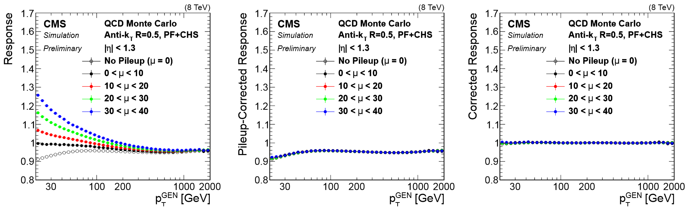
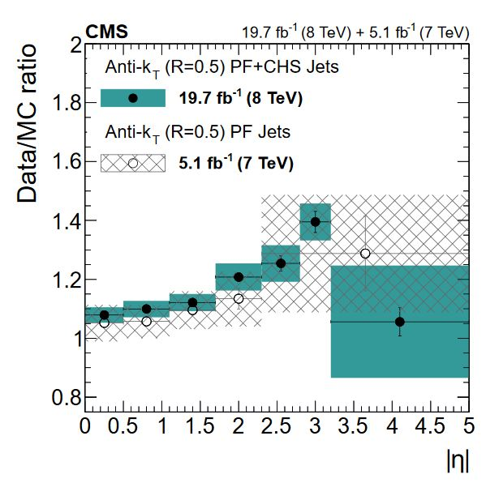
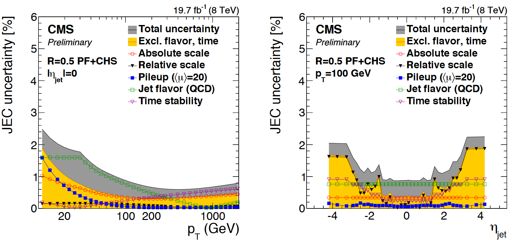
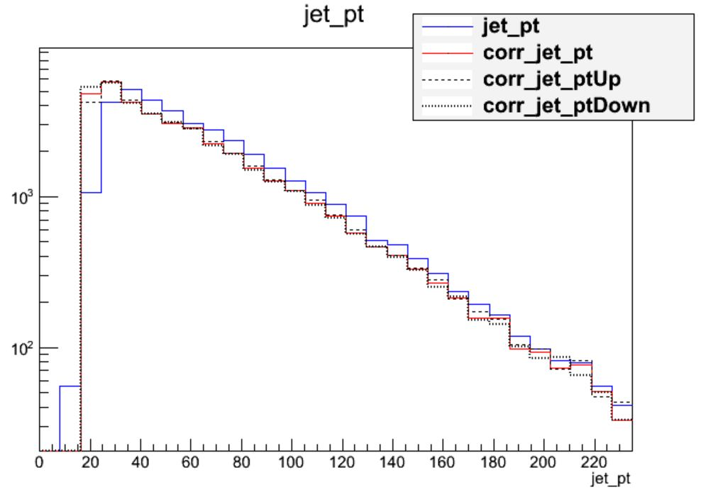
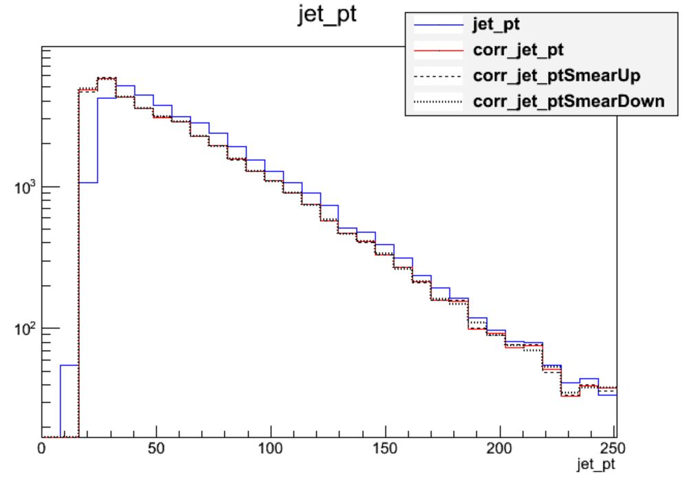
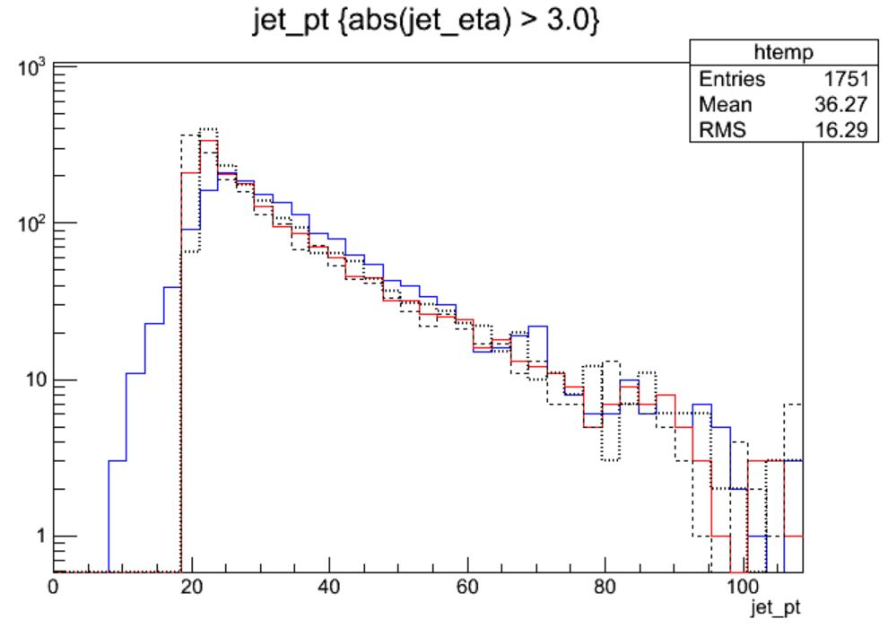
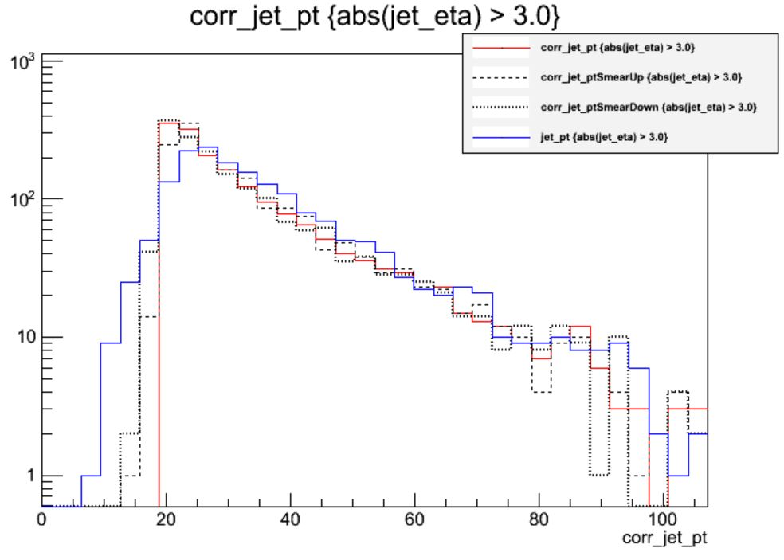

Unsurprisingly, the CMS detector does not measure jet energies perfectly, nor
do simulation and data agree perfectly! The measured energy of jet must be
corrected so that it can be related to the true energy of its parent particle.
These corrections account for several effects and are factorized so that each
effect can be studied independently. All of the corrections in this section are described
in "Jet Energy Scale and Resolution" papers by CMS:
 * [2011, 7 TeV](https://arxiv.org/pdf/1107.4277.pdf)
 * [2017, 8 TeV](https://arxiv.org/abs/1607.03663)

## Correction levels

Particles from additional interactions in nearby bunch crossings of the LHC contribute energy in the calorimeters that must somehow be distinguished from the
energy deposits of the main interaction. Extra energy in a jet's cone can make its measured momentum larger than the momentum of the parent particle.
The first layer ("L1") of jet energy corrections accounts for pileup by subtracting the average transverse momentum contribution of the pileup interactions to
the jet's cone area. This average pileup contribution varies by pseudorapidity and, of course, by the number of interactions in the event. 

The second and third layers of corrections ("L2L3") correct the measured momentum to the true momentum as functions of momentum and pseudorapidity, bringing
the reconstructed jet in line with the generated jet. These corrections are derived using momentum balancing and missing energy techniques in dijet and Z
boson events. One well-measured object (ex: a jet near the center of the detector, a Z boson reconstructed from leptons) is balanced against a jet for which
corrections are derived.

All of these corrections are applied to both data and simulation. Data events are then given "residual" corrections to bring data into line with the corrected
simulation. A final set of flavor-based corrections are used in certain analyses that are especially sensitive to flavor effects.
The figure below shows the result of the L1+L2+L3 corrections on the jet response.

## Jet Energy Resolution

Jet Energy Resolution (JER) corrections are applied after JEC on strictly MC simulations. Unlike JEC, which adjusts the mean of the momentun response distribution, JER adjusts the width of the distribution. The ratio of reconstructed transverse momentum to true (generated) transverse momentum forms a Gaussian distributions -- the width of this Gaussian is the JER. In data, where no "true" pT is available, the JER is measured using photon/Z + jet events where the jet recoils against the photon or Z boson, both of which can be measured quite precisely in the CMS detector. The JER is typically smaller in simulation than in data, leading to scale factors that are larger than 1. These scale factors, along with their uncertainties, are accessible in POET in the jet analyzers. They are applied using two methods:
 * [Adjusting the ratio](https://oaktrust.library.tamu.edu/handle/1969.1/173472) of reconstructed to generated momentum using the scale factor (if a well-matched generated jet is found),
 * Randomly smearing the momentum using a Gaussian distribution based on the resolution and scale factor (if no generated jet is found).

## Applying JEC and JER

The jet energy corrections and Type-1 MET corrections are applied to both small-radius and large-radius jets when you run POET. The segments shown below create two collections of jets called `slimmedJetsNewNEC` and `slimmedJetsAK8NewJEC`. These collections will then be opened in the jet analyzers. In `poet_cfg.py`:

~~~
#----- Apply the final jet energy corrections for 2015 -----#
process.patJetCorrFactorsReapplyJEC = updatedPatJetCorrFactors.clone(src = cms.InputTag("looseAK4Jets"))
if isData: process.patJetCorrFactorsReapplyJEC.levels.append('L2L3Residual')
process.slimmedJetsNewJEC = updatedPatJets.clone(
    jetSource = cms.InputTag("looseAK4Jets"),
    jetCorrFactorsSource = cms.VInputTag(cms.InputTag("patJetCorrFactorsReapplyJEC")),
)
process.patJetCorrFactorsReapplyJECAK8 = updatedPatJetCorrFactors.clone(
        src = cms.InputTag("looseAK8Jets"),
        levels = ['L1FastJet', 'L2Relative', 'L3Absolute'],
        payload = 'AK8PFchs'
        )
if isData: process.patJetCorrFactorsReapplyJECAK8.levels.append('L2L3Residual')
process.slimmedJetsAK8NewJEC = updatedPatJets.clone(
    jetSource = cms.InputTag("looseAK8Jets"),
    jetCorrFactorsSource = cms.VInputTag(cms.InputTag("patJetCorrFactorsReapplyJECAK8")),
)
~~~
{: .language-python}

In the jet analyzers, the "default" jets now have the jet energy corrections applied! But we can still access the "uncorrected jet" from any pat::Jet object:

~~~
for (const pat::Jet &jet : *jets){
  pat::Jet uncorrJet = jet.correctedJet(0);

  // jet is the corrected jet and uncorrJet is the raw jet
}
~~~
{: .language-cpp}

The JER corrections must be accessed from a text file and applied on top of the corrected jets. Helper classes called `JetResolution` and
`JetResolutionScaleFactor` provide access to the scale factors and jet momentum resolutions stored in the text files. 

In the constructor function `JetAnalyzer::JetAnalyzer`:
~~~
jerResName_(iConfig.getParameter<edm::FileInPath>("jerResName").fullPath()),; // JER Resolutions                               
sfName_(iConfig.getParameter<edm::FileInPath>("jerSFName").fullPath()), // JER Resolutions

resolution = JME::JetResolution(jetResName_);
resolution_sf = JME::JetResolutionScaleFactor(sfName_);
~~~
{: .language-cpp}

We can now use `jer_->correction()` to access the jet's momentum resolution in simulation. In the code snippet below you can see "scaling" and "smearing" versions of applying the JER scale factors, depending
on whether or not this `pat::Jet` had a matched generated jet. The random smearing application uses a reproducible seed for the random number generator based on the inherently random azimuthal angle of the jet.

**Note:** this code snippet is simplified by removing lines for handling uncertainties -- that's coming below!
~~~
for (const pat::Jet &jet : *jets){

    ptscale = 1;
    if(!isData) {

        JME::JetParameters JERparameters = { {JME::Binning::JetPt, corrpt}, {JME::Binning::JetEta, jet.eta()}, {JME::Binning::Rho, *(rhoHandle.product())} };
     float res = resolution.getResolution(JERparameters); 
     float sf = resolution_sf.getScaleFactor(JERparameters);
     float sf_up = resolution_sf.getScaleFactor(JERparameters, Variation::UP);
     float sf_down = resolution_sf.getScaleFactor(JERparameters, Variation::DOWN);

     const reco::GenJet *genJet = jet.genJet();
     bool smeared = false;
     if(genJet){
         double deltaPt = fabs(genJet->pt() - corrpt);
        double deltaR = reco::deltaR(genJet->p4(),jet.p4());
        if ((deltaR < 0.2) && deltaPt <= 3*corrpt*res){
              ptscale = max(0.0, 1 + (sf - 1.0)*(corrpt - genJet->pt())/corrpt);
           smeared = true;
        }
        } 
        if (!smeared) {
            TRandom3 JERrand;
   
     JERrand.SetSeed(abs(static_cast<int>(jet.phi()*1e4)));
        ptscale = max(0.0, 1.0 + JERrand.Gaus(0, res)*sqrt(max(0.0, sf*sf - 1.0)));
        }
     }
     if( ptscale*corrpt <= min_pt) continue;

     pat::Jet smearedjet = jet;
     smearedjet.scaleEnergy(ptscale);
}
~~~
{: .language-cpp}

The final, definitive jet momentum is the raw momentum multiplied by both JEC and JER corrections! After computing `ptscale`, we store a variety of corrected and uncorrected kinematic variables for jets passing the momentum threshold.

## Uncertainties

You will have noticed that nested among the JEC and JER code snippets given above were commands related to the uncertainty in these corrections.
The JEC uncertainties have several sources, shown in the figure below. The L1 (pileup) uncertainty dominates at low momentum,
while the L3 (absolute scale) uncertainty takes over for higher momentum jets. All corrections are quite precise for
jets located near the center of the CMS barrel region, and the precision drops as pseudorapidity increases and different
subdetectors lose coverage. 

The JER uncertainty is evaluated by shifting the scale factors up and down according to the error bars shown in the scale factor figure above. These uncertainties arise from treatment of initial and final state radiation in the data measurement, differences in Monte Carlo tunes across generator platforms, and small non-Gaussian tail effects.

The JEC uncertainty text file is loaded as a `JetCorrectionUncertainty` object in the `JetAnalyzer` constructor:
~~~
jetJECUncName_(iConfig.getParameter<edm::FileInPath>("jetJECUncName").fullPath()), // JEC uncertainties

jecUnc_ = boost::shared_ptr<JetCorrectionUncertainty>( new JetCorrectionUncertainty(jecJECUncName_) );
~~~
{: .language-cpp}

This object provides a `getUncertainty()` function that takes in the jet's momentum and pseudorapidity and returns an adjustment to the JEC correction factor:
~~~
for (const pat::Jet &jet : *jets){

    corrpt = jet.pt();
    corrUp = 1.0;
    corrDown = 1.0;

    if( fabs(jet.eta()) < 5) jecUnc_->setJetEta( jet.eta() );
    else jecUnc_->setJetEta( 4.99 );
    jecUnc_->setJetPt( corrpt );
    corrUp = (1 + fabs(jecUnc_->getUncertainty(1)));

    if( fabs(jet.eta()) < 5) jecUnc_->setJetEta( jet.eta() );
    else jecUnc_->setJetEta( 4.99 );
    jecUnc_->setJetPt( corrpt );
    corrDown = (1 - fabs(jecUnc_->getUncertainty(-1)));        
~~~
{: .language-cpp}

The JER uncertainty is evaluated by calculating a `ptscale_up` and `ptscale_down` correction, exactly as shown above for the `ptscale` correction, but using the shifted scale factors. The uncertainties in JEC and JER are kept separate from each other: when varying JEC, the JER correction is held constant, and vice versa. This results in **5 momentum branches**: a central value and two sets of uncertainties:
~~~
jet_corrpt.push_back(smearedjet.pt());
jet_corrptUp.push_back(corrUp*smearedjet.pt());
jet_corrptDown.push_back(corrDown*smearedjet.pt());
jet_corrptSmearUp.push_back(ptscale_up*smearedjet.pt()/ptscale);
jet_corrptSmearDown.push_back(ptscale_down*smearedjet.pt()/ptscale);
~~~
{: .language-cpp}

## Challenge activity (with solutions)

Open `myoutput.root` and investigate the range of momentum variation given by the JEC uncertainties by plotting: 
 * Corrected versus uncorrected jet momentum
 * Corrected jet momentum with JEC up and down uncertainties
 * Corrected jet momentum with JER up and down uncertainties

>## Questions:
>Is the difference between the raw and corrected momentum larger or smaller than the uncertainty?
>Which uncertainty dominates?
>>## Solution
>>The following plotting commands can be used to draw the four histograms needed to answer the first question:
>>~~~
>>$ root -l myoutput.root
>>[1] _file0->cd("myjets");
>>[2] Events->Draw("jet_pt");
>>[3] Events->Draw("jet_corrpt","","hist same");
>>[4] Events->Draw("jet_corrptUp","","hist same");
>>[5] Events->Draw("jet_corrptDown","","hist same");
>>~~~
>>{: .source}
>>
>>
>>
>>We can see that the corrections are significant, far larger than the uncertainty itself. The first level of
>>correction, for pileup removal, tends to reduce the momentum of the jet. The JER uncertainty can be drawn using
>>similar commands:
>>
>>
>>
>>This uncertainty is much smaller for the majority of jets! The JER correction is similar to the muon Rochester
>>corrections in that it is most important for analyses requiring higher precision in jet agreement between data and
>>simulation.
>{: .solution}
>
>Repeat these plots with the additional requirement that the jets be "forward" (`abs(jet_eta) > 3.0`)
>How do the magnitudes of the uncertainties compare in this region?
>
>>## Solution
>>This time we need to apply cuts to the jets as we draw:
>>~~~
>>$ root -l myoutput.root
>>[1] _file0->cd("myjets");
>>[2] Events->Draw("jet_pt","abs(jet_eta) > 3.0");
>>[3] Events->Draw("jet_corrpt","abs(jet_eta) > 3.0","hist same");
>>[4] Events->Draw("jet_corrptUp","abs(jet_eta) > 3.0","hist same");
>>[5] Events->Draw("jet_corrptDown","abs(jet_eta) > 3.0","hist same");
>>~~~
>>{: .source}
>>
>>
>>
>>
>>In the endcap region the uncertainty on the JER scale factor has become nearly 20%! So this uncertainty
>>gains almost equal footing with JEC. Many CMS analyses restrict themselves to studying jets in the "central"
>>region of the detector, defined loosely by the tracker acceptance region of `abs(eta) < 2.4` precisely to
>>avoid these larger JEC and JER uncertainties.
>{: .solution}
{: .objectives}


